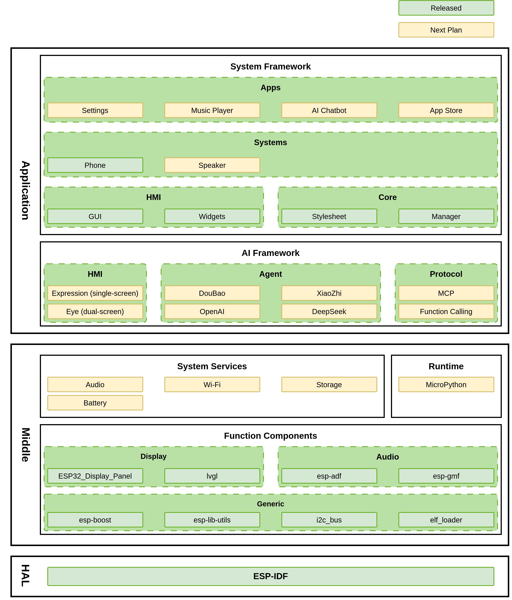

# ESP-Brookesia Arduino LVGL 9

This repository is a community fork of Espressif ESP-Brookesia.

Goal:

- keep the Arduino IDE library packaging from ESP-Brookesia `0.4.x`
- port the codebase from LVGL 8 APIs to LVGL 9
- keep ESP32 / ESP32-S3 Arduino users able to build a Phone-style UI with launcher, status bar, navigation and app isolation

Status: active fork. The initial import was ESP-Brookesia `0.4.2`; the current source tree is backported from ESP-Brookesia `0.5.0` to get LVGL 9 APIs while keeping Arduino metadata and examples. The Arduino `Phone` example compiles with Arduino ESP32 core `3.3.8`, LVGL `9.5.0`, and a `huge_app` partition. A hardware-specific `Phone_Waveshare_CO5300_CST9220` example is also available for the Waveshare ESP32-S3 Touch AMOLED 2.16; it uses a local custom partition table because the full demo exceeds the 3 MB `huge_app` slot when Arduino_GFX and SensorLib are linked. The Waveshare example has now been runtime-validated on hardware for app launch, app pause/resume via home, recents carousel navigation, close by trash, close by upward swipe, and automatic return to the launcher when the last app is closed. Current port status and remaining limits are tracked in [PORTING_LVGL9.md](./PORTING_LVGL9.md).

Arduino IDE setup notes:

- Install this repository itself as an Arduino library under `Documents/Arduino/libraries/esp-brookesia-arduino-lvgl9`, or create a symlink there to your working tree. Opening an example directly from an arbitrary unzip directory is not enough for `#include <esp_brookesia.hpp>`.
- Do not copy the repository `src/` folder into a sketch folder. Arduino can otherwise compile duplicate Brookesia sources and fail with redefinition errors.
- For the generic `examples/arduino/Phone` sketch, install these dependent libraries from the Arduino IDE Library Manager:
  - `ESP32_Display_Panel`
  - `ESP32_IO_Expander`
  - `esp-lib-utils`
  - `lvgl`
- For the Waveshare-specific `examples/arduino/Phone_Waveshare_CO5300_CST9220` sketch, install:
  - `lvgl`
  - `GFX Library for Arduino`
  - `SensorLib`
  - `XPowersLib` (AXP2101 battery, charging and power-service support)
- `ESP32_Display_Panel` and `ESP32_IO_Expander` are not used by the Waveshare sketch itself, but they remain dependencies for the generic Arduino examples and for the library metadata.

The Waveshare example includes an optional device-services layer: top-edge control centre, notifications and scheduled jobs, QMI8658 automatic rotation, physical-key launcher navigation, NTP, status indicators, persisted brightness/radio preferences, a one-minute user-idle display-off policy, display leases for foreground apps, and a bounded 1S LiPo charging profile. It intentionally does **not** enter raw ESP32 deep sleep yet: the PWR/PMU wake wiring and wake sources must be verified on the physical board first, otherwise an automatic deep-sleep test can make the device appear dead. The AXP2101 temperature is the PMU die temperature, not a cell temperature; an external battery NTC remains necessary for true cell thermal protection. The validated CO5300 rotation pipeline and its Arduino_GFX QSPI performance constraint are documented in [PORTING_LVGL9.md](./PORTING_LVGL9.md).

Upstream references:

- ESP-Brookesia `0.4.2`: last Arduino-packaged line, LVGL 8
- ESP-Brookesia `0.5.0`: LVGL 9 port by Espressif, but Arduino support removed

---

 

**Latest Arduino Library Version**: 

**Latest Espressif Component Version**: 

# ESP-Brookesia

* [中文版本](./README_CN.md)

## Overview

ESP-Brookesia is a human-machine interaction development framework designed for AIoT devices. It aims to simplify the processes of user UI design and application development by supporting efficient development tools and platforms, thereby accelerating the development and market release of customers' HMI application products.

> [!NOTE]
> "[Brookesia](https://en.wikipedia.org/wiki/Brookesia)" is a genus of chameleons known for their ability to camouflage and adapt to their surroundings, which closely aligns with the goals of the ESP-Brookesia. This framework aims to provide a flexible and scalable UI solution that can adapt to various devices, screen sizes, and application requirements, much like the Brookesia chameleon with its high degree of adaptability and flexibility.

The key features of ESP-Brookesia include:

- Developed in C++, it can be compiled for `PC` or `ESP SoCs` platforms and supports `VSCode`, `ESP-IDF`, and `Arduino` development environments.
- Offers a rich set of standardized system UIs with support for dynamic UI style adjustments.
- Implements an app-based application management approach, ensuring UI isolation and coexistence across multiple apps, enabling users to focus on UI implementation within their target app.
- Application UIs are compatible with "[Squareline](https://squareline.io/) exported code" development methods.

The system UI functionality demonstration is as follows:

    

    <a href="https://docs.espressif.com/projects/esp-dev-kits/en/latest/esp32p4/esp32-p4-function-ev-board/index.html">ESP32-P4-Function-EV-Board</a> running system UI - <a href="./docs/system_ui_phone_CN.md">Phone</a>
     
    (<a href="https://dl.espressif.com/AE/esp-dev-kits/esp_ui_phone_demo_1024_600_compress.mp4">Click to view the video</a>)

 

The functional block diagram of ESP-Brookesia is as follows, mainly consisting of the following components:

    

 

- **System UI Core**: Implements the unified core logic of all system UIs, including app management, stylesheet management, event management, etc.
- **System UI Widgets**: Encapsulates common widgets for system UIs, including status bar, navigation bar, gesture, etc.
- **System UIs**: Implements various types of system UIs based on "System UI Core" and "System UI Widgets".
- **Squareline**: Contains multiple versions of *ui_helpers* files exported from "Squareline Studio" to avoid function name conflicts when used across multiple apps.
- **Fonts**: Contains the default fonts used by the system UIs.

## Usage

Please refer to the documentation - [How to Use](./docs/how_to_use.md).

## System UIs

Currently, ESP-Brookesia offers the following system UIs:

- [Phone](./docs/system_ui_phone.md)

## System UI Widgets

Please refer to the documentation - [System UI Widgets](./docs/system_ui_widgets.md).
